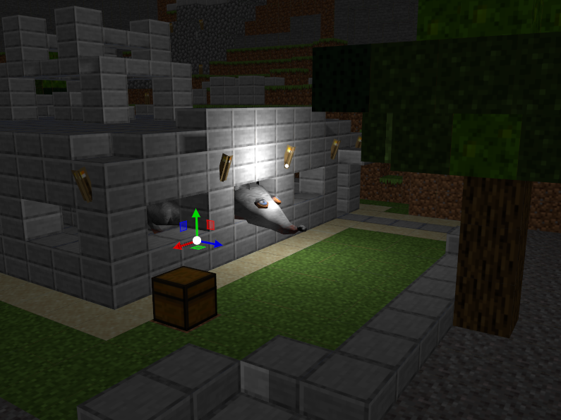

# Shitty Renderer

A Vulkan Renderer written in C++ 23. Very much WIP.



Control movement via Splines that minimize rotation via bishops frames!

<https://user-images.githubusercontent.com/8939023/225312673-ae9748e1-c363-45c1-ad7c-fdabec51e73d.mp4>

## Building

To build on Windows install the Vulkan SDK from <https://vulkan.lunarg.com/sdk/home#windows> and set the environment variable `VULKAN_HOME` to the install location.

On arch install `sudo pacman -S vulkan-devel shaderc`

## Credits

Based upon [Vulkan Tutorial](https://vulkan-tutorial.com), inspiration drawn from [Vulkan Guide](https://vkguide.dev/)
and [Brendan Galea's YouTube series](https://www.youtube.com/c/BrendanGalea).
Some ideas were also taken from [Zeux's blog](https://zeux.io/2020/02/27/writing-an-efficient-vulkan-renderer/).

## TODO

- [x] Finish chapters of Vulkan-Tutorial
  - [x] Texture Mapping
    - [x] Images
    - [x] Image view and sampler
    - [x] Combined image sampler
      - [x] Fix gamma problem
      - [x] Fix flipped problem
  - [x] Depth buffering
    - [x] Fix the problems present in the chapter: <https://stackoverflow.com/questions/62371266/why-is-a-single-depth-buffer-sufficient-for-this-vulkan-swapchain-render-loop>
  - [x] Loading Models
  - [x] Generating Mipmaps
  - [x] Multisampling
- [x] Copy Textures to output folder automatically
  - [x] Add it as custom command so it is done on build
- [x] Move Model Matrix into push constant, but leave proj and view in UBO
- [x] Load more objects
  - [x] Introduce VMA, VK-Guide has a tutorial for this. Else the buffer management is too complex
    - [x] uploadIndices and uploadVertices can be generalized and simplified.
    - [x] Descriptors need to be dynamically allocated, as they currently fill the pool.
      - <https://vkguide.dev/docs/extra-chapter/abstracting_descriptors/>
      - Potentially just make a dynamic allocator which creates a pool for each type?
        - Then, when a descriptor set for textures is asked for, more can just be allocated. This would avoid any memory problems.
    - [x] TextureImage VMA.
    - [x] UniformBuffer still uses manual buffer creation. They should be moved over.
    - [x] It's possible to load an array of textures, this should make it easier to load different textures
      - <https://gist.github.com/NotAPenguin0/284461ecc81267fa41a7fbc472cd3afe>
- [x] Load Lost Empire
  - [x] Current memory usage is crazy, figure out what is causing that.
    - Around 349mb for 'lost_empire-RGB.png'.
    - Compression is needed, probably KTX.
    - It can be added by following the information in <https://github.com/KhronosGroup/Vulkan-Samples/blob/main/third_party/CMakeLists.txt>
  - [x] Textures are uploaded multiple times.
- [x] Add wireframe mode which can be switched to.
- [ ] Change from using a single primary command buffer to multiple secondary command buffers
  - There are resources for how to do this at:
    - <https://zeux.io/2020/02/27/writing-an-efficient-vulkan-renderer/>
    - <https://github.com/KhronosGroup/Vulkan-Samples/tree/master/samples/performance/command_buffer_usage>
    - <https://vkguide.dev/docs/extra-chapter/multithreading/>
  - These secondary command buffers could be recorded in parallel in systems.
- [ ] Stop blocking when uploading textures, there is currently a wait on idle which is unnecessary.
  - Should probably also use the transfer queue.
  - Usage of transfer queue is only possible for some commands.
    - Therefore, a dedicated upload command is needed, which is separate from the mip map calculation.
    - Through another possibility is using multiple graphics queues. But the transfer queue might be faster so I need to look in to that.
  - Could be done in the asset manager and the handle could be checked to see if they are ready.
- [ ] Create an Asset Library that makes resources ready for the engine. Should include loading and storing of binary data. Reading the data is the responsibility of the program.
  - <https://vkguide.dev/docs/extra-chapter/asset_system/>
  - [ ] Meshes
  - [ ] Textures
    - [ ] MipMaps
- [x] Add a deletion queue instead of cleanup.
- [ ] Update to use Synchro2. <https://www.khronos.org/blog/vulkan-timeline-semaphores>
- [x] Incorporate changes found by Charles
  - <https://github.com/Overv/VulkanTutorial/issues/202>
  - <https://github.com/Overv/VulkanTutorial/pull/255>
- [x] Fix controls after adding Imgui
  - [x] Only capture mouse clicks if not over ui.
- [x] ~~Yoink list from <https://github.com/knightcrawler25/GLSL-PathTracer> to choose what objects should be manipulated by ImGuizmo~~
  - I just use a ray to select instead.
- [ ] Use VMA.hpp instead
- [ ] Create a style to autoformat with
- [ ] Move swap chain to its own class
- [x] Fix the hash for checking if vertices are equal.
- [x] Fix that cast which are needed because of VMA, probably just put it in a class which has a hpp interface.
  - Currently makes it so new versions of MSVC cant compile the project.
  - Was caused by compiling for 32 bit, so don't do that.
- [ ] Abstract pipelines some more
  - Maybe create some systems which holds the pipeline and layout.
  - The systems could also have a render function.
- [ ] Create handles for materials and uploaded models, currently its just returned as an object.
  - The handles could be `uint64_t`.
  - This would also remove the shared ptr, which is weird to use anyway as the lifetime of the object is more than the data.
- [x] Smooth resize
  - [x] Use old_swapchain when creating a new swapchain
  - [x] Never resize in the drawing thread, only call resize in the  OS 'resize callback/event'
  - [x] In the OS 'resize callback/even', repaint the scene.
  - [x] Never delete resources (images, views, framebuffers) in the resize. Instead put it in a delayed-deletion-queue. This will delete it when its no longer being used in a couple of frames
  - [x] use imageless framebuffer
  - [x] If the items in 4 and 5 are implemented, the resize function will not need to call vkDeviceWaitIdle()
- [x] Implement Compute shaders <https://github.com/Overv/VulkanTutorial/pull/320>
- [x] Delete `Renderer::uploadBuffer` it should be handled by `AssetManager`
- [x] Create multiple vk::Framebuffer swapChainFramebuffers.
  - No don't do that, i made the change because it is imageless now.
- [x] Move cmake for third party to the folder containing them.
- [ ] Fix sync issues <https://github.com/Overv/VulkanTutorial/issues/276>
- [x] Fix cursor jumping bug due to ImGui getting input from another thread than GLFW. Need to sync IO somehow, someone on the Vulkan Discord Suggested modeling it as Producer/Consumer problem.
  - Might not be worth it to have more threads as they still need to sync.
- [ ] Add a way to control spline normal from both ends.
  - Might be possible to add normals from both ends and then interpolate between the two linearly along the path.
  - <https://gamedev.stackexchange.com/questions/94098/controlling-roll-rotation-when-travelling-along-bezier-curves>
  - Will probably be a trade off between given the user control and how jank it can look if they mess it up.
  - Interpolating between the two quaternion from each end should work.
- [x] deform meshes along spline. <https://stackoverflow.com/questions/69208203/bend-a-mesh-along-spline>
- [ ] Rename files and introduce a namespace.
  - Physics, Spline and Path are terrible naming right now. Also BEH is bad prefix
- [ ] Pre-dock debug info in ImGui, probably with a `DockBuilder`.
- [ ] Size the debug windows to the size of their content.
- [ ] Use shared_ptr reference counting in AssetManager to clean up unused assets when space is low.
  - Reference count of 1 means it can be cleaned.
- [ ] Move loading of models and textures to a class which can have multiple `loaders`.
  - Each loader has a `canHandle` and `handle` method that returns either a material or a mesh depending on the type of loader.
- [x] Implement clickable control objects, which don't collide. This should be possible with <https://pybullet.org/Bullet/BulletFull/classbtGhostObject.html#details>
  - Should be tied together with the spline
- [ ] Make a component for if a entity is allowed to be manipulated with the gizmo and which ones.
- [ ] There is probably a lot of memory leaks from using new in relation to physics.
  - This might have been fixed when i moved to Jolt. Need to check first
- [ ] Rework the spline class, it should only compute once it is dirty which should only happen on changes in the transform.
- [ ] Sensors should not scale. But there should still be a way to scale the control point.
- [ ] Maybe all buffers should be typed.
  - Has the problem that if I want to use buffer as a different type I can not. Which can be a problem.
- [ ] Fix minimize on windows
  - `Validation layer: Validation Error: [ VUID-VkSwapchainCreateInfoKHR-imageExtent-01689 ] Object 0: handle = 0x16f47f34660, type = VK_OBJECT_TYPE_DEVICE; | MessageID = 0x13140d69 | vkCreateSwapchainKHR(): pCreateInfo->imageExtent = (0, 0) which is illegal. The Vulkan spec states: imageExtent members width and height must both be non-zero (https://vulkan.lunarg.com/doc/view/1.3.224.1/windows/1.3-extensions/vkspec.html#VUID-VkSwapchainCreateInfoKHR-imageExtent-01689)`
- [ ] RenderObject should not be used a component, Need a different wrapper for that
  - Which means that the transform sent to the engine should be given from the `Transform` component
- [ ] Transform sources should be mutually exclusive, which I don't know if I can check.
  - So that any single entity only has one. Else it gets confusing about where it should be.
- [ ] Fix collisions shapes so that they are the same size as the model.
- [x] Make a input event enum, so there is reliance on the key pressed later.
- [x] Maybe make a way to have systems depend on each other so they can run in order and can be sorted?
  - Could be an abstract class with a setup(registry) function, update and dependencies.
  - Then have a enum of all dependencies and use dependency sorting to call them in the correct order.
- [ ] Figure out where Components should be placed.
- [x] Maybe delete players if they disconnect?
- [x] Add a way to have read/write without it impacting of it's execution.
  - Maybe it is possible with a struct as a template variable <https://brevzin.github.io/c++/2019/12/02/named-arguments/>
- [ ] Remove the need for `Others<>` in the system type.
  - Probably just by making multiple classes that do the same thing.
  - I don't actually know if this is a good idea. It can be used for coordinating systems.
    - So might be useful to keep around a while longer.
- [ ] Add a background cube map, the black is getting annoying.
- [x] Investigate the jittering issue from the vehicle driving around. A post on the Bullet forums mentioned it possibly being due to large bodies.
- [ ] Make spline deformation better.
  - [ ] Use the total arc length to create N meshes, where N ~= (arc length)/(mesh length)
  - [ ] Add a scale on y and z axis for scaling the meshes. It should be linearly interpolated for between control points.
  - [ ] Test with more than 2 control points.
  - [ ] Actually upload the damn thing each frame
- [ ] Add buffers for often updated geometry, the current method of writing all the data each frame is horribly slow.
  - Care needs to be taken when and how they are deleted/written to, as a currently used buffer is considered off limits.
  - Possibly have SwapChainImages persistently mapped buffers for each kind of this data. Like I have for lines.
    - Then just a call to update them which updates them over the next N frames before they are used.
    - Also some way to only delete part of it probably.
      - Malloc, Alloc style.
    - <https://stackoverflow.com/questions/62182124/most-generally-correct-way-of-updating-a-vertex-buffer-in-vulkan>
  - Another way to do this for just the splines would be to index in a buffer of transforms instead of using the push constant.
    - This would mean that the interpolation happens on the GPU and only the transforms need to uploaded.
- [ ] Add some better ambient light <https://learnopengl.com/Lighting/Basic-Lighting>
- [ ] A way to decide what a Sensor is allowed to collide with, maybe by it's tag.
  - Also maybe adding a function that is executed upon collision would be nice.
  - The Jolt api for start collision and stop is a bit wonk due to sleep.
- [x] Add to the systems that they may write to other registers without getting them as parameters.
  - Can be done with `Others<>`
- [x] Figure out why ray cast vehicle glitches through the ground.
  - Was due to the wheel ray cast origin not being inside the collision shape.
- [ ] Make a collision editor and a serialization system for collision shapes.
- [x] Maybe make a change to btRayCastVehicle so it uses btMultiBody and add that moving platforms should add speed to the wheels.
  - This change could be upstreamed <https://pybullet.org/Bullet/phpBB3/viewtopic.php?t=6365>
  - Also it has a todo in the code to add driving on moving platforms.
  - Lol never mind, changed to a different physics library.
- [ ] Make a precompiled header file, which includes all the files i want to precompile include. Then just include that file everywhere?
  - Need to look up how this is best done.
- [ ] Add lateral and longitudinalFriction to the car physics.
- [ ] Create debugging UI for the Car which allows for changing its settings while running.
  - `VehicleConstraint::GetConstraintSettings()` is not implemented and it is marked const.
  - So I probably need to recreate the constraint if it is changed.
- [ ] Physics should be rendered for next frame and interpolated towards which should reduce stuttering.
- [ ] Probably set the target position and target look in the camera and call update later.
- [ ] Make different kind of camera controllers which takes input and controls the camera.
  - [ ] Free fly, Just takes keyboard.
  - [ ] Car follow, takes a Car state as input. Probably Needs to be a entity pointer as it might be on another entity.
    - Can probably just be a physics object it follows in this case. It also has a velocity.
    - Keyboard should also allow for rotating the camera around the object in any case.
  - Might be an idea to allow mutiple cameras to exists on many objects or more on just one. And then just switch between them.
- [ ] Possibly move adding/onRemove to Physics file to make sure that the correct components are added and removed.
- [ ] C# scripting could probably be done with .NET hosting. <https://github.com/dotnet/samples/tree/main/core/hosting>
  - Mono is another choice, <http://nilssondev.com/mono-guide/book/>
    - <https://github.com/lambdageek/monovm-embed-sample>
      - Check the forks if someone has something better first.
  - DotNetEvolution recommended just using mono. An integration can be found in <https://github.com/crazytuzi/UnrealCSharp>
- [ ] Use name "Krake" for everything.
  - Repo should be called "Krake Engine" and namespace "krake"
- [ ] Seperate parts out in seperate projects
  - [x] Rendering
  - [ ] Client
  - [ ] Asset Loading
  - [x] Shapes and Curves Library
  - [ ] Make a CMakeLists.txt for resources and shaders.
- [ ] Make a editor UI for scenes.
  - <https://github.com/jmorton06/Lumos> has something similiar to what I want to build.
  - Figure out how this should work with the swapchain and renderpass. 
    - Either just render to an image that gets shown in ImGui or else it might be possible to simple only render part of the screen.
      - Only rendering to part of it, would avoid recreating the swapchain which can be very slow.
  - [ ] Make some way to debug entities, so that every (or just some) components can be shown in the ui.
    - [ ] Could be by registering Typed commands for each component
    - [ ] And base functions which handles each other type.
    - Lumos also does this
- [ ] Figure out where in the Yojimbo loops that messages should be recieved. Current method can crash.
- [ ] There seems to be a bug when a box interacts with mesh shape at a sharp angle which causes a crash.
- [ ] Change the camera to have distance and such as saved fields. So Only the position, rotation and position is sent.
  - [ ] The camera should then be called update on to allow it to ease.
- [ ] Fix the camera so it does not point in a nonsense direction at the start.

### Descriptor Layout Idea

The DescriptorSet setup could work by creating DescriptorSetLayouts before.
Then validating the created DescriptorSets against a provided layout.
The DescriptorSetLayout could also have a builder
`.addBinding(uint32_t binding, vk::DescriptorType type, vk::ShaderStageFlags stageFlags, uint32t_t count = 1)`
If any binding has > 1 count, then it should be variable length and partially bound.
Only the last binding may have variable length, so this should also be checked. Maybe it should just be a flag?
[VK_DESCRIPTOR_BINDING_VARIABLE_DESCRIPTOR_COUNT_BIT](https://registry.khronos.org/vulkan/specs/1.3-extensions/man/html/VkDescriptorBindingFlagBits.html)

Using a buffer for the other locations might be a possibility to still add all material properties as bindless. But that is to be looked at.

Then the DescriptorBuilder would have

```cpp
DescriptorBuilder &bindBuffer(uint32_t binding, vk::DescriptorBufferInfo *bufferInfo, vk::DescriptorType type);
DescriptorBuilder &bindImage(uint32_t binding, vk::DescriptorImageInfo *imageInfo, vk::DescriptorType type);
DescriptorBuilder &bindImages(uint32_t binding, std::vector<vk::DescriptorImageInfo>& imageInfos, vk::DescriptorType type);
```

bindImages would also validate that the length is less than the max set in descriptor builder.

### Handles

To simplify handling of resources it's probably easier if the interface of the renderer has Handles as return values.
So uploading a mesh returns a `MeshHandle` and similarly for a Materials.

```cpp
struct MeshHandle {
  uint64_t handle;
};
```

A builder could then be used to get these materials, as there is probably going to be quite a few ways to do it.
But this might require that the result of the build is a pair of `MeshHandle` and `Optional<MaterialHandle>`.
Do not really know how nice that would be.

```cpp
auto [mesh, material] = 
  MeshBuilder::begin(renderer)
    .loadObj("filename.obj") // Maybe this is just load Mesh? Then delegate to the correct loader
    .loadMtl() // tinyObj loads the materials if referenced in the obj file
    .upload(); // upload to the GPU either now or later. 
```

When the ECS system gets added these handles could then be held together in a Mesh Component.

Using would also avoid callbacks as the renderer would just ignore meshes and materials that have not been uploaded yet, as the ECS view will not take them.
This would simplify the interaction model.

Maybe the engine returns futures, this could then be checked for results in the ECS and swapped for the result when ready.

```cpp
std::future<UploadedMesh> uploadMesh();

registry.view<std::future<UploadedMesh>>.each([&](auto entity, auto& result) {
    if(result.valid()) {
      registry.emplace<UploadedMesh>(entity, result.get());
      registry.remove<std::future<UploadedMesh>>(entity); // This is safe according to the documentation
    }
  });
```

The future wait could probably even templated and added as a list of Functions as to make it easy to extend.

### Physics multithreading idea

Need to separate the physics out to a separate thread, which means that transforms from previous iteration should be available.
These can be saved to a data structure and copied to a synced reference when ready.
Which means that the lock only happens while changing the reference.
The data should only be the transforms at the start, but might have AABB later for frustum culling.
The start up an update should be getting this reference, which probably means keeping it in a shared pointer.
Probably `atomic<shared_ptr<map<id, transform>>>`, then have the physics component just have the id for the index.

```cpp
struct PhysicsComponent { // Maybe just Physics? Check what other engines use as naming.
  uint64_t id; // Maybe typedef this.
};
```

Each of the updates that need the transforms can then get it passed it in the call to their update.

```cpp
void update(float delta) {
  auto transforms = world->getLatestTransforms();
  aiSystem->update(delta, transforms, jobs);
  objectSystem->update(delta, transforms, jobs);
  particleSystem->update(delta, transforms, jobs);
  world->step(delta, jobs);
  jobs->waitAll(); // Wait for all jobs which the systems create to be done.
}
```

This means that they all use the same transforms and thereby gives consistent results.

To allow for doing tasks which rely on `btDynamicWorld`, tasks can be dispatched to world which is executed before stepping.
These tasks would then create messages or call callbacks to give the information back later.
Tasks could be: CreateBody, DeleteBody or RayTest.
To make it easy to implement this a callback should probably just be used at the start with documentation saying they are not thread-safe.

### Concurrent system graph execution

Note: This needs sync access to the registry

Because systems are executed in order of dependencies it should be possible to execute them concurrently.
Through care should be made to make sure that only one system can write to each type at a time.
This could be done by assigning an id to each write and other component when added to the system.
The ID could then be used in a set to make sure that each component is only being written to by one system at a time.
One efficient implementation of this would be a atomic bitset in which all currently write locks are held.
When a system starts all its writes component are locked by id and unlocked when the system finishes.
As only one system is allowed to write at a time for each component it can simple assign the rows to 0.
`boost::dynamic` is probably a good implementation to use for this as it is faster than `std::vector<bool>`.

Pseudo code for the process, the implementation actually uses int keys to avoid copying or using pointers.

```cpp

std::vector<SystemNode> systems;
std::vector<SystemNode> ready; 
std::vector<SystemNode> waitingOnWrites;
bitset writeLocks(countComponents(systems));

void startExecution(SystemNode system) {
  system.execute();
  system.informDependents();
  writeLocks &= (!system.writeBitSet()) // Remove all the write locks we took.
  runAllReady();
}

void runAllReady() {
  for (int i = 0; i < ready.size(); i++) {
    if (ready[i].writeBitSet() & writeLocks == false) { // No overlap in locks. Also probably needs to be a atomic assign with an bit and, as it will be checked from multiple threads. 
      theadPool.post(startExecution(ready[i]));
      // remove the system
    }
  }
}

void runSystems() {
  for (auto system : systems) {
    if (system.reads().size() == 0) {
      ready.push_back(system);
    }
    else {
      waitingOnWrites.push_back(system);
    }
  }
  runAllReady();
}
```

### Making registry thread safe

According to the [entt documentation](https://github.com/skypjack/entt/wiki/Crash-Course:-entity-component-system#multithreading), the registry is not thread safe.
This is not a huge problem as the system graph avoids multiple components being written to at the same time.
But the System type needs to be expanded to have `Creates<>` which takes all the types it creates.
Create types should be treated like writes, but not given as parameters to the update function, as the view cant find them yet.
`entt::registry::create` probably needs to happen with a lock.
Deletion of a entity should happen by adding a deletion tag which are then deleted by a single system later, as it modifies all components on an entity.

#### Another way to thread safety

Possible using `Others<...>` (and maybe renaming it) could work for everything else the system access.
So if it creates and deletes entities, it be possible to just use registry as the type it access in Others.

### Parallel system

Each system could also be parallelized as they only operate on a single entity.
Then the ISystem could check if the class is a Parallel system if it is give it access to it's thread pool.
Through some scheduling is probably needed to make sure it does not starve other systems from starting.

```cpp

struct ParallelSystem<Self, size_t GroupSize, Reads<Read...>, Writes<Write...>, Others<Other...>> : virtual ISystem {
  void initParallel(thread_pool pool); 

  void update() // Get GroupSize entities and start a task with them in the thread pool. 
}
```

### Debug Physics view

The old system to show debugging of physics was too slow as it uploaded vertices each frame.
Instead it should be possible to save the shape in a component and draw each of them.
As most thing consists of simple geometry it should be possible to use instancing to draw these.
Mesh colliders and height maps might need to be uploaded and use the mesh handle explained earlier.
Moving the physics shapes could then be done with the transform.
